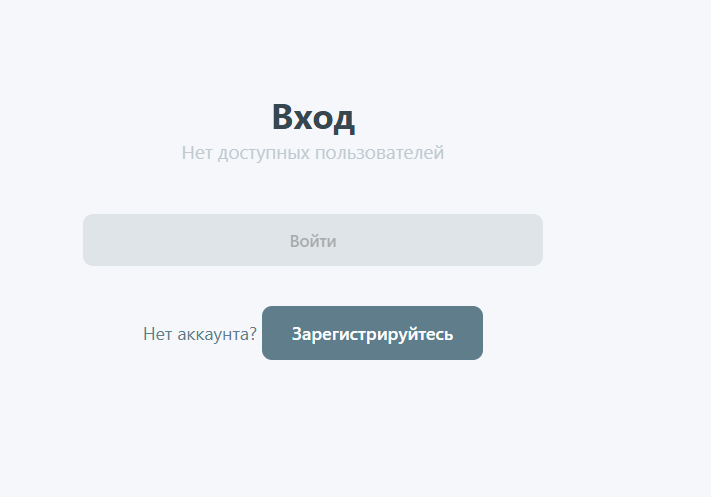
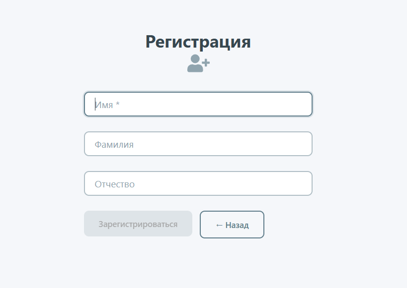
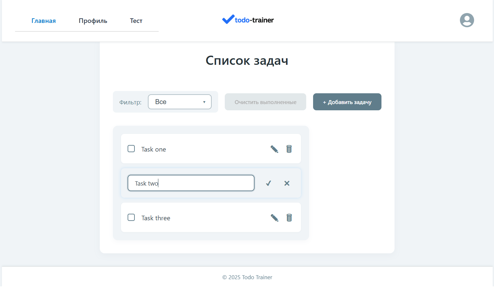
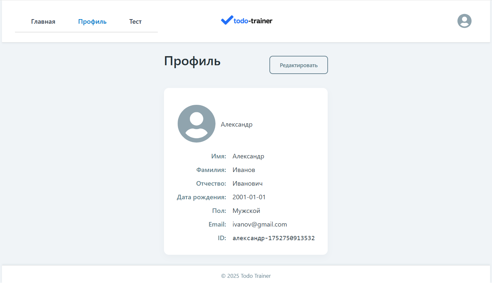
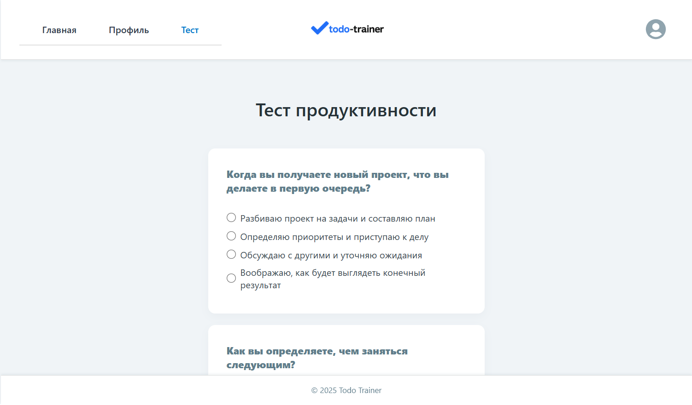
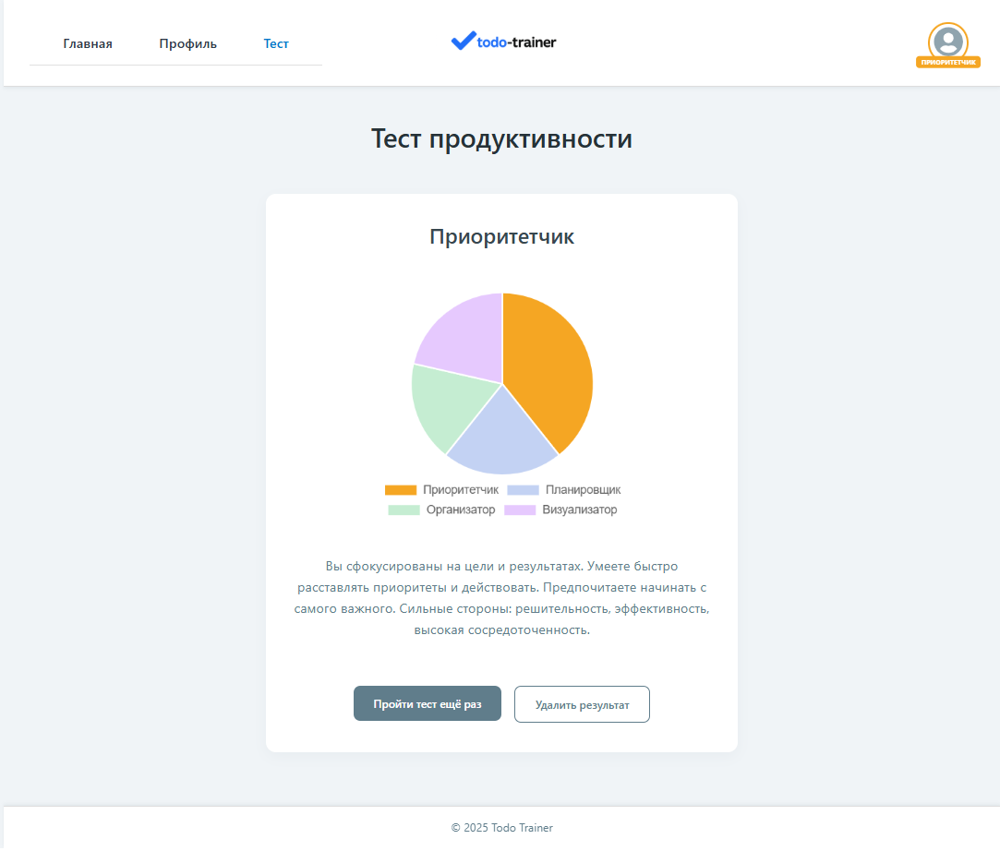

# Todo Trainer / Тренажёр задач

[](./LICENSE)

**Todo Trainer** - это минималистичное учебное SPA-приложение с адаптивной версткой. Оно поддерживает регистрацию, авторизацию пользователей, фильтрацию и редактирование задач.

**Todo Trainer** is a minimalist educational SPA with responsive layout. It supports user registration, authorization, filtering and editing of tasks.

---

## ⚙️ Features / Особенности

- 🧍‍♂️ Регистрация пользователей
- 🧑‍💼 Авторизация
- 📋 Список задач с состоянием (все, активные, выполненные)
- ➕ Добавление задач с валидацией
- ✏️ Редактирование и удаление задач
- ✅ Отметка о выполнении задачи
- 🔄 Очистка завершённых задач
- ⏪ Переход назад с сохранением истории
- 🎯 Состояние фильтра по типу задач
- 🧠 Сохранение задач в локальном хранилище по пользователю
- 🧾 Модуль профиля пользователя с возможностью редактирования
- 🖼️ Адаптивная верстка и hover-подсказки

/

- 🧍‍♂️ User registration
- 🧑‍💼 Authentication
- 📋 Task list with state (all / active / completed)
- ➕ Task creation with validation
- ✏️ Edit and delete tasks
- ✅ Task completion mark
- 🔄 Clear completed tasks
- ⏪ Back navigation with history
- 🎯 Filter status by task type
- 🧠 Saving tasks in local storage by user
- 🧾 User profile module with editing capability
- 🖼️ Adaptive layout with tooltips

---

## 📸 Screenshots / Скриншоты

### 🔐 Авторизация


### 🧍‍♂️ Регистрация


### 📋 Список задач


### 🧑‍💼 Профиль


### 🧪 Тест


### 🧪 Результат тестирования


---

## 📦 Stack / Технологии

- React + Vite
- React Router v7 (`createBrowserRouter`)
- Redux Toolkit + reselect
- CSS Modules
- LocalStorage для данных
- Анимации через `react-transition-group`

---

## 🚀 Getting Started / Запуск

```bash
git clone https://github.com/AlexandrMaspanov/todo-trainer.git
cd todo-trainer
npm install
npm run dev
```
---

Local app will be available at: http://localhost:5173/todo-trainer/

Приложение будет доступно по адресу: http://localhost:5173/todo-trainer/

---

## License / Лицензия

[MIT](LICENSE)

---

## Author / Автор

Developed by [Александр Маспанов](https://github.com/AlexandrMaspanov)
